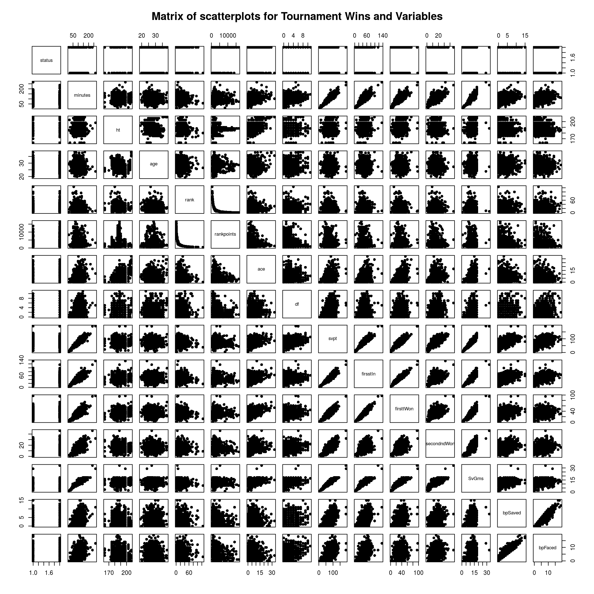
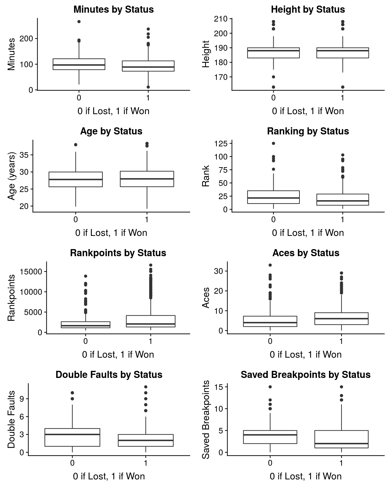
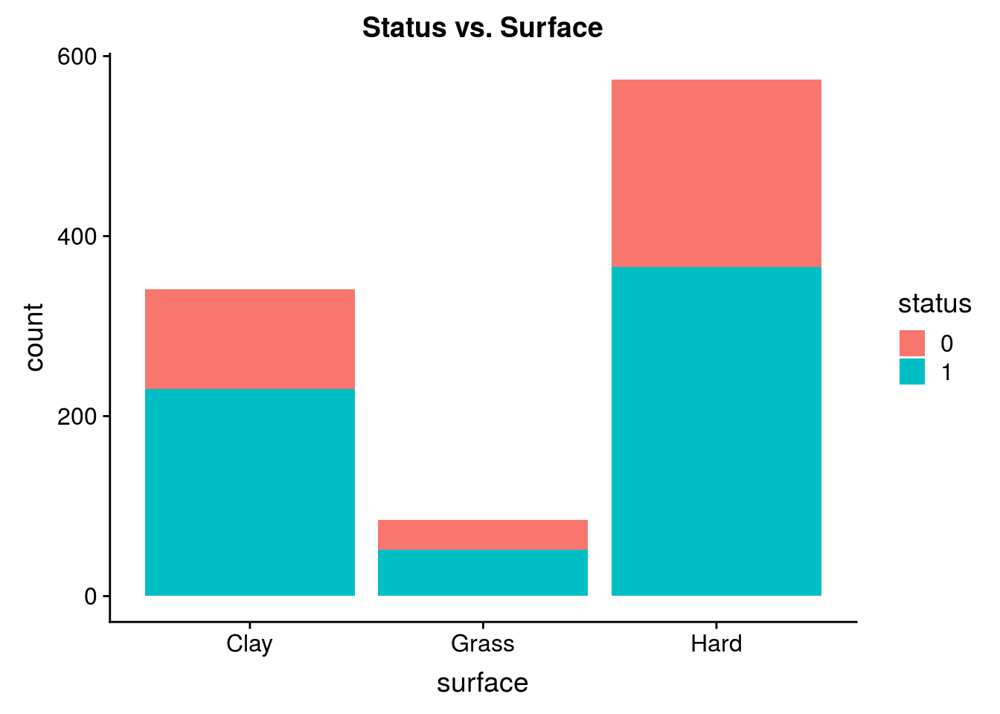
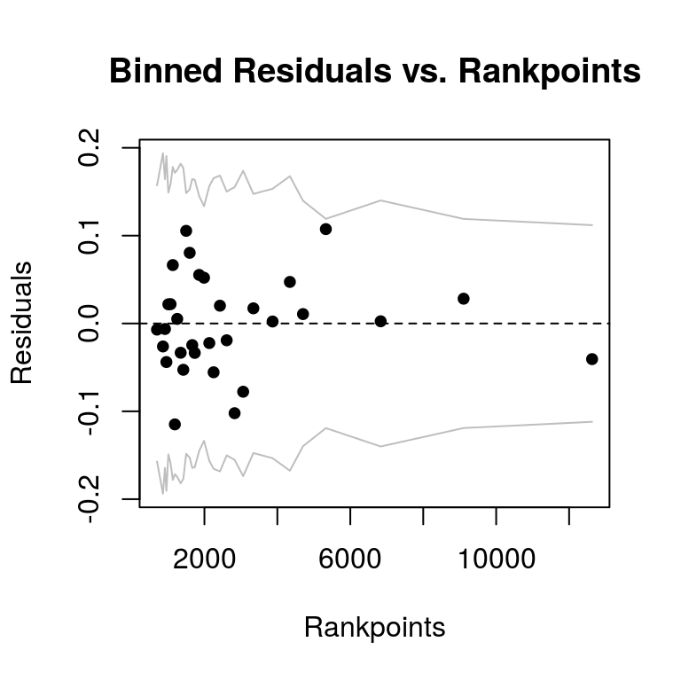
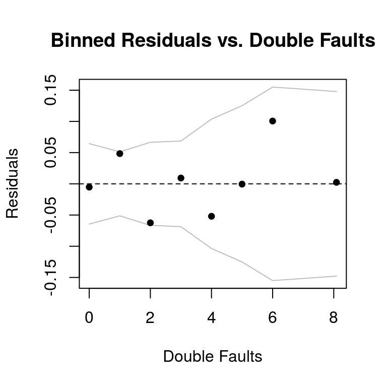
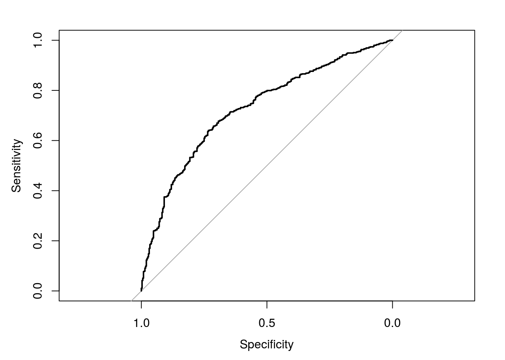

```r
library(tidyverse)
library(olsrr)
library(cowplot)
library(car)
library(broom)
library(knitr)
library(arm)
library(tidyr)
library(pROC)
library(arm)
```


# Data 

Using data manipulation skills in R, we shaped the dataset to show each observation as the outcome of the match for the winner and the loser of each match from 2010-2017. Below, is a glimpse of our dataset.


```r
glimpse(tennis)
```

```
## Observations: 11,037
## Variables: 66
## $ tourney_id         <chr> "2017-M020", "2017-M020", "2017-M020", "201...
## $ tourney_name       <chr> "Brisbane", "Brisbane", "Brisbane", "Brisba...
## $ surface            <chr> "Hard", "Hard", "Hard", "Hard", "Hard", "Ha...
## $ draw_size          <int> 32, 32, 32, 32, 32, 32, 32, 32, 32, 32, 32,...
## $ tourney_level      <chr> "A", "A", "A", "A", "A", "A", "A", "A", "A"...
## $ tourney_date       <int> 20170102, 20170102, 20170102, 20170102, 201...
## $ match_num          <int> 300, 299, 298, 297, 296, 295, 294, 293, 292...
## $ winner_id          <int> 105777, 105777, 105453, 105683, 105777, 105...
## $ winner_seed        <int> 7, 7, 3, 1, 7, 3, 2, 1, 5, 4, 7, 3, 2, 5, 7...
## $ winner_entry       <chr> NA, NA, NA, NA, NA, NA, NA, NA, NA, NA, NA,...
## $ winner_name        <chr> "Grigor Dimitrov", "Grigor Dimitrov", "Kei ...
## $ winner_hand        <chr> "R", "R", "R", "R", "R", "R", "R", "R", "L"...
## $ winner_ht          <int> 188, 188, 178, 196, 188, 178, 183, 196, 185...
## $ winner_ioc         <chr> "BUL", "BUL", "JPN", "CAN", "BUL", "JPN", "...
## $ winner_age         <dbl> 25.63450, 25.63450, 27.01164, 26.01780, 25....
## $ winner_rank        <int> 17, 17, 5, 3, 17, 5, 4, 3, 9, 8, 17, 5, 4, ...
## $ winner_rank_points <int> 2035, 2035, 4905, 5450, 2035, 4905, 5315, 5...
## $ loser_id           <int> 105453, 105683, 104527, 104745, 106233, 111...
## $ loser_seed         <int> 3, 1, 2, 5, 4, NA, NA, NA, NA, NA, NA, NA, ...
## $ loser_entry        <chr> NA, NA, NA, NA, NA, "WC", NA, NA, NA, "WC",...
## $ loser_name         <chr> "Kei Nishikori", "Milos Raonic", "Stanislas...
## $ loser_hand         <chr> "R", "R", "R", "L", "R", "R", "R", "R", "L"...
## $ loser_ht           <int> 178, 196, 183, 185, 185, NA, NA, 170, 190, ...
## $ loser_ioc          <chr> "JPN", "CAN", "SUI", "ESP", "AUT", "AUS", "...
## $ loser_age          <dbl> 27.01164, 26.01780, 31.76728, 30.58453, 23....
## $ loser_rank         <int> 5, 3, 4, 9, 8, 79, 45, 52, 51, 180, 39, 105...
## $ loser_rank_points  <int> 4905, 5450, 5315, 3300, 3415, 689, 1001, 86...
## $ score              <chr> "6-2 2-6 6-3", "7-6(7) 6-2", "7-6(3) 6-3", ...
## $ best_of            <int> 3, 3, 3, 3, 3, 3, 3, 3, 3, 3, 3, 3, 3, 3, 3...
## $ round              <chr> "F", "SF", "SF", "QF", "QF", "QF", "QF", "R...
## $ minutes            <int> 108, 87, 101, 140, 124, 61, 156, 69, 55, 89...
## $ w_ace              <int> 7, 4, 1, 23, 3, 3, 11, 12, 1, 11, 8, 3, 7, ...
## $ w_df               <int> 2, 1, 1, 3, 3, 0, 3, 1, 2, 1, 0, 3, 2, 1, 0...
## $ w_svpt             <int> 77, 58, 77, 97, 94, 34, 119, 53, 38, 65, 46...
## $ w_1stIn            <int> 52, 36, 56, 62, 52, 19, 67, 40, 18, 44, 27,...
## $ w_1stWon           <int> 41, 27, 37, 50, 42, 18, 47, 30, 15, 36, 25,...
## $ w_2ndWon           <int> 12, 18, 14, 16, 23, 10, 28, 7, 15, 15, 12, ...
## $ w_SvGms            <int> 13, 10, 11, 15, 14, 7, 16, 9, 7, 11, 9, 15,...
## $ w_bpSaved          <int> 5, 0, 4, 6, 13, 0, 11, 2, 2, 4, 3, 4, 0, 2,...
## $ w_bpFaced          <int> 7, 0, 5, 7, 14, 0, 13, 3, 2, 4, 3, 8, 1, 3,...
## $ l_ace              <int> 4, 4, 9, 4, 6, 1, 2, 0, 2, 11, 4, 6, 5, 2, ...
## $ l_df               <int> 0, 3, 2, 0, 5, 2, 2, 1, 2, 1, 3, 4, 7, 2, 3...
## $ l_svpt             <int> 69, 61, 61, 84, 82, 47, 97, 44, 38, 58, 52,...
## $ l_1stIn            <int> 49, 28, 37, 61, 37, 28, 65, 29, 25, 35, 37,...
## $ l_1stWon           <int> 36, 24, 27, 39, 29, 15, 52, 17, 13, 34, 27,...
## $ l_2ndWon           <int> 9, 16, 10, 14, 24, 5, 11, 6, 3, 9, 4, 20, 8...
## $ l_SvGms            <int> 12, 10, 10, 14, 14, 7, 16, 8, 7, 10, 9, 14,...
## $ l_bpSaved          <int> 2, 2, 0, 2, 4, 3, 6, 2, 3, 3, 0, 8, 3, 0, 4...
## $ l_bpFaced          <int> 5, 4, 2, 4, 7, 8, 10, 6, 8, 4, 3, 13, 5, 4,...
## $ seed               <int> 7, 7, 3, 1, 7, 3, 2, 1, 5, 4, 7, 3, 2, 5, 7...
## $ name               <chr> "Grigor Dimitrov", "Grigor Dimitrov", "Kei ...
## $ hand               <chr> "R", "R", "R", "R", "R", "R", "R", "R", "L"...
## $ ht                 <int> 188, 188, 178, 196, 188, 178, 183, 196, 185...
## $ age                <dbl> 25.63450, 25.63450, 27.01164, 26.01780, 25....
## $ rank               <int> 17, 17, 5, 3, 17, 5, 4, 3, 9, 8, 17, 5, 4, ...
## $ rankpoints         <int> 2035, 2035, 4905, 5450, 2035, 4905, 5315, 5...
## $ ace                <int> 7, 4, 1, 23, 3, 3, 11, 12, 1, 11, 8, 3, 7, ...
## $ df                 <int> 2, 1, 1, 3, 3, 0, 3, 1, 2, 1, 0, 3, 2, 1, 0...
## $ svpt               <int> 77, 58, 77, 97, 94, 34, 119, 53, 38, 65, 46...
## $ firsstIn           <int> 52, 36, 56, 62, 52, 19, 67, 40, 18, 44, 27,...
## $ firsttWon          <int> 41, 27, 37, 50, 42, 18, 47, 30, 15, 36, 25,...
## $ secondndWon        <int> 12, 18, 14, 16, 23, 10, 28, 7, 15, 15, 12, ...
## $ SvGms              <int> 13, 10, 11, 15, 14, 7, 16, 9, 7, 11, 9, 15,...
## $ bpSaved            <int> 5, 0, 4, 6, 13, 0, 11, 2, 2, 4, 3, 4, 0, 2,...
## $ bpFaced            <int> 7, 0, 5, 7, 14, 0, 13, 3, 2, 4, 3, 8, 1, 3,...
## $ status             <dbl> 1, 1, 1, 1, 1, 1, 1, 1, 1, 1, 1, 1, 1, 1, 1...
```

Because we have 11,037 observations, we will randomly select observations to be included in a smaller dataset so that we can effectively examine exploratory data analysis. Below, is our code on how we randomly selected the observations in our new dataset.


```r
set.seed(1234)
ten <- tennis %>% sample_n(1000)
```

Here is what our new dataset looks like:


```r
glimpse(ten)
```

```
## Observations: 1,000
## Variables: 66
## $ tourney_id         <chr> "2016-M021", "2010-314", "2010-404", "2010-...
## $ tourney_name       <chr> "Madrid Masters", "Gstaad", "Indian Wells M...
## $ surface            <chr> "Clay", "Clay", "Hard", "Grass", "Clay", "H...
## $ draw_size          <int> 64, 32, 96, 32, 56, 32, 32, 28, 32, 96, 32,...
## $ tourney_level      <chr> "M", "A", "M", "A", "A", "A", "A", "A", "A"...
## $ tourney_date       <int> 20160502, 20100725, 20100311, 20100705, 201...
## $ match_num          <int> 283, 29, 33, 27, 26, 293, 293, 3, 295, 37, ...
## $ winner_id          <int> 105683, 104755, 103819, 103888, 104857, 106...
## $ winner_seed        <int> 11, 7, 1, 5, NA, NA, 1, 7, 4, 11, 4, 16, 8,...
## $ winner_entry       <chr> NA, NA, NA, NA, "Q", "Q", NA, NA, NA, NA, N...
## $ winner_name        <chr> "Milos Raonic", "Richard Gasquet", "Roger F...
## $ winner_hand        <chr> "R", "R", "R", "R", "R", "R", "R", "R", "R"...
## $ winner_ht          <int> 196, 185, 185, 188, 193, NA, 178, 183, 198,...
## $ winner_ioc         <chr> "CAN", "FRA", "SUI", "USA", "COL", "SVK", "...
## $ winner_age         <dbl> 25.34702, 24.10404, 28.58042, 28.56947, 25....
## $ winner_rank        <int> 10, 47, 1, 79, 246, 117, 5, 41, 12, 12, 12,...
## $ winner_rank_points <int> 2740, 930, 11350, 651, 195, 501, 4625, 1010...
## $ loser_id           <int> 105238, 103393, 103812, 104433, 104665, 105...
## $ loser_seed         <int> NA, NA, NA, NA, 16, 1, NA, NA, 7, NA, 8, NA...
## $ loser_entry        <chr> NA, "Q", NA, NA, NA, NA, NA, NA, NA, "Q", N...
## $ loser_name         <chr> "Alexandr Dolgopolov", "Yuri Schukin", "Vic...
## $ loser_hand         <chr> "R", "R", "R", "R", "R", "R", "R", "R", "R"...
## $ loser_ht           <int> 180, 188, 198, 185, 180, 198, 170, 188, 183...
## $ loser_ioc          <chr> "UKR", "KAZ", "ROU", "CAN", "ESP", "CRO", "...
## $ loser_age          <dbl> 27.48255, 31.08282, 28.62971, 25.77139, 26....
## $ loser_rank         <int> 29, 147, 43, 336, 38, 6, 50, 122, 19, 89, 2...
## $ loser_rank_points  <int> 1330, 344, 905, 115, 1070, 3650, 890, 500, ...
## $ score              <chr> "6-4 6-7(3) 6-2", "6-3 6-4", "6-3 6-7(5) 6-...
## $ best_of            <int> 3, 3, 3, 3, 3, 3, 3, 3, 3, 3, 3, 3, 3, 3, 3...
## $ round              <chr> "R32", "SF", "R64", "QF", "R32", "R16", "R1...
## $ minutes            <int> 121, 89, 117, 134, 170, 168, 124, 120, 132,...
## $ w_ace              <int> 17, 6, 10, 7, 9, 8, 3, 1, 19, 9, 22, 6, 7, ...
## $ w_df               <int> 2, 6, 2, 2, 1, 2, 0, 1, 1, 3, 4, 0, 1, 3, 1...
## $ w_svpt             <int> 95, 72, 95, 91, 123, 130, 92, 82, 86, 57, 8...
## $ w_1stIn            <int> 70, 42, 52, 45, 76, 83, 61, 62, 58, 39, 54,...
## $ w_1stWon           <int> 56, 33, 41, 38, 49, 55, 43, 39, 51, 32, 42,...
## $ w_2ndWon           <int> 14, 16, 27, 26, 25, 30, 13, 12, 18, 10, 21,...
## $ w_SvGms            <int> 15, 10, 15, 16, 17, 18, 14, 12, 15, 10, 15,...
## $ w_bpSaved          <int> 4, 2, 6, 2, 10, 9, 8, 5, 0, 2, 4, 1, 1, 0, ...
## $ w_bpFaced          <int> 4, 2, 7, 5, 15, 11, 11, 7, 0, 3, 5, 1, 4, 1...
## $ l_ace              <int> 7, 2, 1, 6, 1, 18, 2, 0, 2, 1, 13, 5, 17, 5...
## $ l_df               <int> 1, 1, 1, 5, 5, 2, 0, 5, 1, 4, 7, 2, 5, 5, 0...
## $ l_svpt             <int> 95, 57, 101, 98, 103, 113, 81, 82, 108, 69,...
## $ l_1stIn            <int> 56, 32, 77, 54, 64, 69, 56, 53, 82, 49, 44,...
## $ l_1stWon           <int> 39, 25, 48, 42, 47, 53, 35, 34, 51, 33, 32,...
## $ l_2ndWon           <int> 24, 12, 10, 15, 17, 26, 8, 13, 16, 8, 30, 6...
## $ l_SvGms            <int> 15, 9, 13, 16, 17, 18, 14, 12, 16, 10, 14, ...
## $ l_bpSaved          <int> 3, 4, 8, 1, 3, 3, 4, 9, 4, 8, 8, 2, 6, 6, 7...
## $ l_bpFaced          <int> 6, 6, 12, 6, 8, 5, 10, 13, 7, 11, 12, 6, 8,...
## $ seed               <int> 11, 7, 1, 5, 16, 1, 1, 7, 7, 11, 8, 16, 8, ...
## $ name               <chr> "Milos Raonic", "Richard Gasquet", "Roger F...
## $ hand               <chr> "R", "R", "R", "R", "R", "R", "R", "R", "R"...
## $ ht                 <int> 196, 185, 185, 188, 180, 198, 178, 183, 183...
## $ age                <dbl> 25.34702, 24.10404, 28.58042, 28.56947, 26....
## $ rank               <int> 10, 47, 1, 79, 38, 6, 5, 41, 19, 12, 22, 24...
## $ rankpoints         <int> 2740, 930, 11350, 651, 1070, 3650, 4625, 10...
## $ ace                <int> 17, 6, 10, 7, 1, 18, 3, 1, 2, 9, 13, 6, 7, ...
## $ df                 <int> 2, 6, 2, 2, 5, 2, 0, 1, 1, 3, 7, 0, 1, 5, 1...
## $ svpt               <int> 95, 72, 95, 91, 103, 113, 92, 82, 108, 57, ...
## $ firsstIn           <int> 70, 42, 52, 45, 64, 69, 61, 62, 82, 39, 44,...
## $ firsttWon          <int> 56, 33, 41, 38, 47, 53, 43, 39, 51, 32, 32,...
## $ secondndWon        <int> 14, 16, 27, 26, 17, 26, 13, 12, 16, 10, 30,...
## $ SvGms              <int> 15, 10, 15, 16, 17, 18, 14, 12, 16, 10, 14,...
## $ bpSaved            <int> 4, 2, 6, 2, 3, 3, 8, 5, 4, 2, 8, 1, 1, 6, 1...
## $ bpFaced            <int> 4, 2, 7, 5, 8, 5, 11, 7, 7, 3, 12, 1, 4, 10...
## $ status             <dbl> 1, 1, 1, 1, 0, 0, 1, 1, 0, 1, 0, 1, 1, 0, 1...
```

# Exploratory Data Analysis 

To begin our exploratory data analysis, we will examine a matrix plot of the variables in our dataset to consider multicollinearity and large leverage of certain observations.

## Matrix Plot

```r
ten <- ten %>%
  mutate(status = as.factor(status)) 

pairs(status ~ minutes + ht + age + rank + rankpoints + ace +
        df + svpt + firsstIn + firsttWon + secondndWon + 
        SvGms + bpSaved + bpFaced, data=ten, pch = 16,
      main = "Matrix of scatterplots for Tournament Wins and Variables")
```



Looking at the matrix plot, we will already consider removing the following favirables because of multicollinearity: `svpt`, `firsstIn`, `firsttWon`, `secondndWon`, `SvGms`, and `bpFaced`.

We will now look at box plots of the numeric variables we will include in our full model:


```r
p1 <- ggplot(data=ten,aes(x=status,y=minutes)) +
  geom_boxplot() + 
  labs(title="Minutes by Status",
       x = "0 if Lost, 1 if Won",
       y = "Minutes")
p2 <- ggplot(data=ten,aes(x=status,y=ht)) +
  geom_boxplot() + 
  labs(title="Height by Status",
       x = "0 if Lost, 1 if Won",
       y = "Height")
p3 <- ggplot(data=ten,aes(x=status,y=age)) +
  geom_boxplot() + 
  labs(title="Age by Status",
       x = "0 if Lost, 1 if Won",
       y = "Age (years)")
p4 <- ggplot(data=ten,aes(x=status,y=rank)) +
  geom_boxplot() + 
  labs(title="Ranking by Status",
       x = "0 if Lost, 1 if Won",
       y = "Rank")
p5 <- ggplot(data=ten,aes(x=status,y=rankpoints)) +
  geom_boxplot() + 
  labs(title="Rankpoints by Status",
       x = "0 if Lost, 1 if Won",
       y = "Rankpoints")
p6 <- ggplot(data=ten,aes(x=status,y=ace)) +
  geom_boxplot() + 
  labs(title="Aces by Status",
       x = "0 if Lost, 1 if Won",
       y = "Aces")
p7 <- ggplot(data=ten,aes(x=status,y=df)) +
  geom_boxplot() + 
  labs(title="Double Faults by Status",
       x = "0 if Lost, 1 if Won",
       y = "Double Faults")
p8 <- ggplot(data=ten,aes(x=status,y=bpSaved)) +
  geom_boxplot() + 
  labs(title="Saved Breakpoints by Status",
       x = "0 if Lost, 1 if Won",
       y = "Saved Breakpoints")

plot_grid(p1,p2,p3,p4,p5,
          p6,p7,p8,ncol=2)
```



And we will include a stacked bar graph for the variable `surface`.


```r
ggplot(data=ten,aes(x=surface)) + geom_bar(aes(fill=status)) + 
  labs(title="Status vs. Surface")
```



In looking at all of these observations, it seems like the medians of the numeric distributions do not seem to differ that much by status of winning or losing. The same can be said about the proportions of winning and losing matches against all three surfaces. In creating our model, it could be difficult to see which variables could be helpful in differentiating between whether a player will win a match or not. But, we hope to see that a combination of these variables will be helpful in determining a model that best predicts the percentage of winning a match.

# Logistic Regression Model

To begin our regression models, we will use all of the variables we deemed important from our exploratory data analysis.


```r
full_model <- glm(status ~ minutes + ht + age + rank + 
                rankpoints + ace + df + bpSaved + surface, 
                family=binomial,data=ten)
kable(tidy(full_model), format="markdown", digits = 3)
```


|term         | estimate| std.error| statistic| p.value|
|:------------|--------:|---------:|---------:|-------:|
|(Intercept)  |    5.060|     2.219|     2.280|   0.023|
|minutes      |   -0.007|     0.003|    -2.607|   0.009|
|ht           |   -0.024|     0.011|    -2.278|   0.023|
|age          |    0.024|     0.022|     1.085|   0.278|
|rank         |   -0.002|     0.006|    -0.279|   0.780|
|rankpoints   |    0.000|     0.000|     3.963|   0.000|
|ace          |    0.108|     0.019|     5.674|   0.000|
|df           |   -0.140|     0.037|    -3.830|   0.000|
|bpSaved      |   -0.077|     0.029|    -2.650|   0.008|
|surfaceGrass |   -0.580|     0.280|    -2.076|   0.038|
|surfaceHard  |   -0.494|     0.165|    -3.000|   0.003|


```r
model.selected <- step(full_model,direction="backward")
```

```
## Start:  AIC=1197.61
## status ~ minutes + ht + age + rank + rankpoints + ace + df + 
##     bpSaved + surface
## 
##              Df Deviance    AIC
## - rank        1   1175.7 1195.7
## - age         1   1176.8 1196.8
## <none>            1175.6 1197.6
## - ht          1   1180.8 1200.8
## - minutes     1   1182.4 1202.4
## - bpSaved     1   1182.6 1202.6
## - surface     2   1185.7 1203.7
## - df          1   1190.5 1210.5
## - rankpoints  1   1195.0 1215.0
## - ace         1   1210.9 1230.9
## 
## Step:  AIC=1195.69
## status ~ minutes + ht + age + rankpoints + ace + df + bpSaved + 
##     surface
## 
##              Df Deviance    AIC
## - age         1   1176.8 1194.8
## <none>            1175.7 1195.7
## - ht          1   1180.9 1198.9
## - minutes     1   1182.5 1200.5
## - bpSaved     1   1182.8 1200.8
## - surface     2   1185.8 1201.8
## - df          1   1190.8 1208.8
## - ace         1   1211.3 1229.3
## - rankpoints  1   1213.2 1231.2
## 
## Step:  AIC=1194.85
## status ~ minutes + ht + rankpoints + ace + df + bpSaved + surface
## 
##              Df Deviance    AIC
## <none>            1176.8 1194.8
## - ht          1   1183.0 1199.0
## - bpSaved     1   1183.9 1199.9
## - minutes     1   1184.0 1200.0
## - surface     2   1187.5 1201.5
## - df          1   1191.6 1207.6
## - ace         1   1214.4 1230.4
## - rankpoints  1   1214.4 1230.4
```

# Linear Regression Assumptions


```r
kable(tidy(model.selected), format = "markdown", digits = 3)
```


|term         | estimate| std.error| statistic| p.value|
|:------------|--------:|---------:|---------:|-------:|
|(Intercept)  |    5.987|     1.982|     3.020|   0.003|
|minutes      |   -0.007|     0.003|    -2.670|   0.008|
|ht           |   -0.026|     0.011|    -2.473|   0.013|
|rankpoints   |    0.000|     0.000|     5.411|   0.000|
|ace          |    0.110|     0.019|     5.838|   0.000|
|df           |   -0.139|     0.037|    -3.801|   0.000|
|bpSaved      |   -0.077|     0.029|    -2.652|   0.008|
|surfaceGrass |   -0.596|     0.278|    -2.142|   0.032|
|surfaceHard  |   -0.505|     0.164|    -3.077|   0.002|


```r
final.base.model <- model.selected
kable(tidy(final.base.model), format = "markdown", digits = 3)
```


|term         | estimate| std.error| statistic| p.value|
|:------------|--------:|---------:|---------:|-------:|
|(Intercept)  |    5.987|     1.982|     3.020|   0.003|
|minutes      |   -0.007|     0.003|    -2.670|   0.008|
|ht           |   -0.026|     0.011|    -2.473|   0.013|
|rankpoints   |    0.000|     0.000|     5.411|   0.000|
|ace          |    0.110|     0.019|     5.838|   0.000|
|df           |   -0.139|     0.037|    -3.801|   0.000|
|bpSaved      |   -0.077|     0.029|    -2.652|   0.008|
|surfaceGrass |   -0.596|     0.278|    -2.142|   0.032|
|surfaceHard  |   -0.505|     0.164|    -3.077|   0.002|

Interaction effects?

# Model Assessment

## Binned Plots with Residuals vs Predicted


```r
ten <- ten %>% mutate(Residuals = residuals.glm(final.base.model,type="response"),
                          Predicted = predict.glm(final.base.model,type="response"))

binnedplot(ten$Predicted, ten$Residuals,xlab="Predicted Probabilities",
           ylab="Residuals",main="Binned Residuals vs. Predicted Probabilities")
```





```r
ROC.ten <- roc(ten$status,ten$Predicted,plot=T)
```




```r
ROC.ten$auc
```

```
## Area under the curve: 0.7209
```


```r
threshold = 0.30
table(ten$status, ten$Predicted > threshold)
```

```
##    
##     FALSE TRUE
##   0    14  338
##   1    13  635
```


```r
(338 + 13)/(14+13+338+635)
```

```
## [1] 0.351
```


# Prediction

## Test cases: 


# Conclusion


