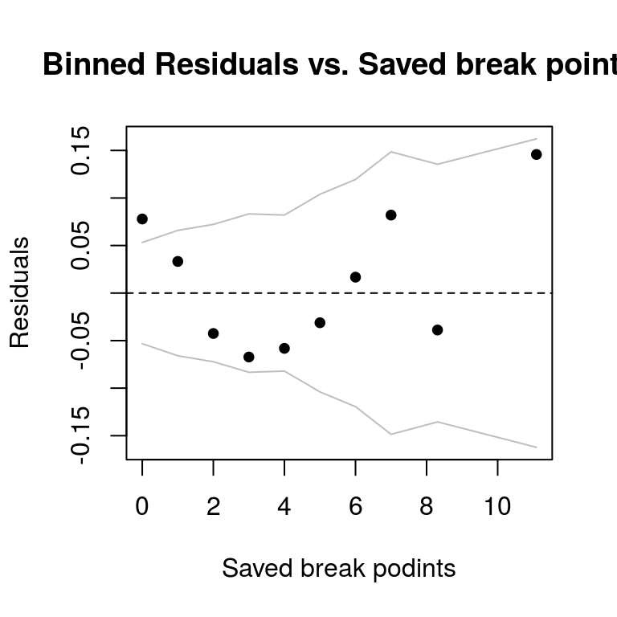
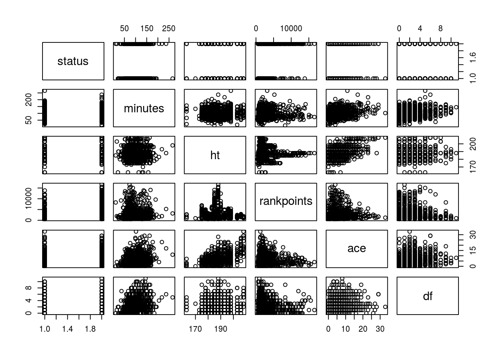
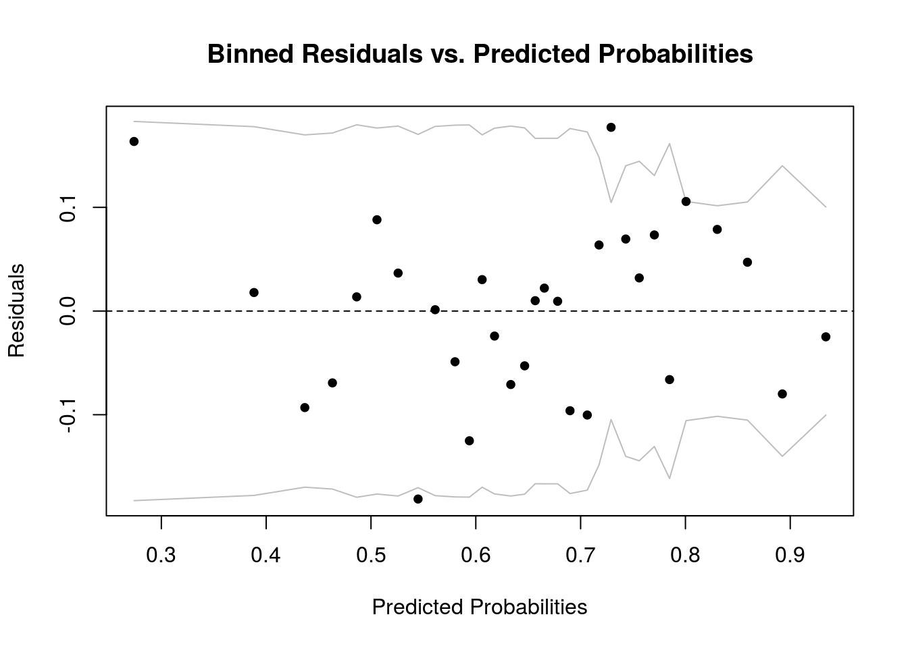
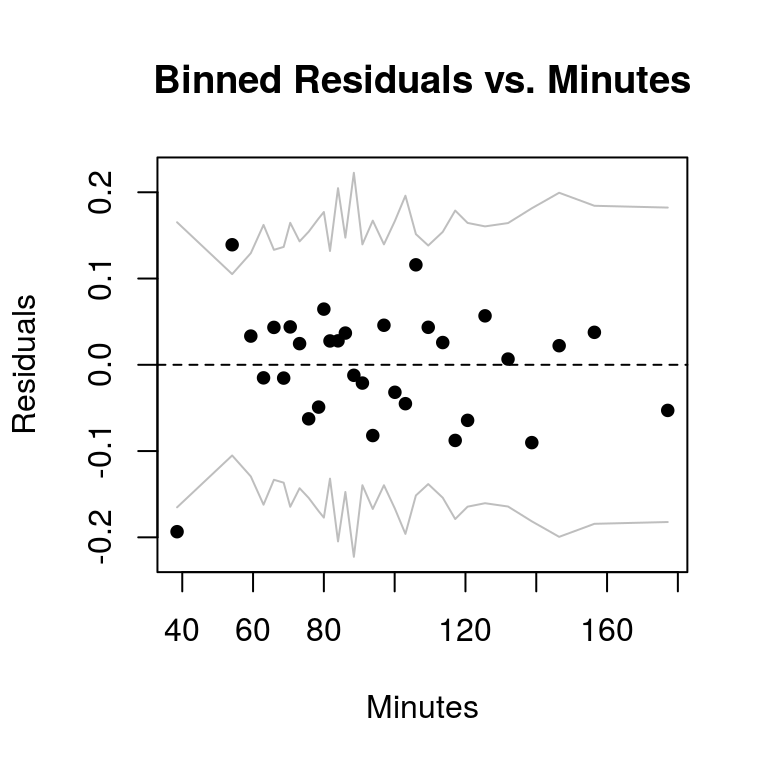
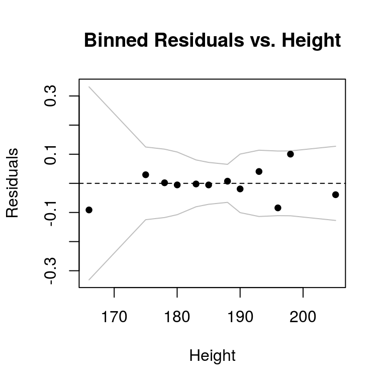
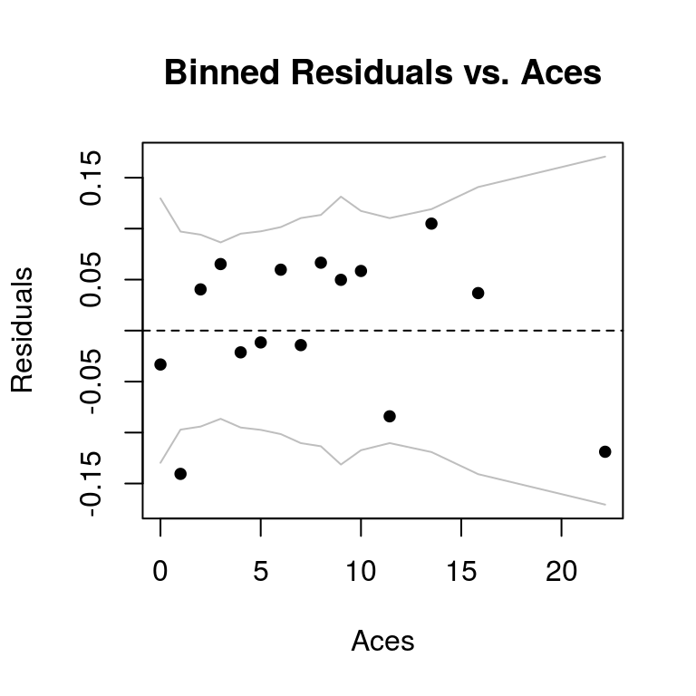
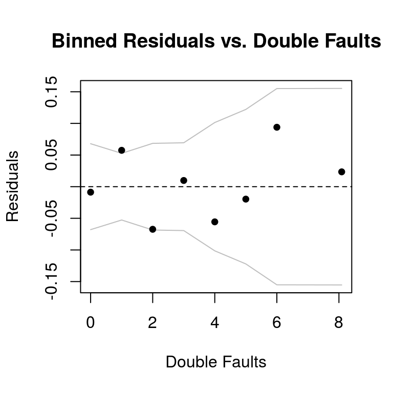
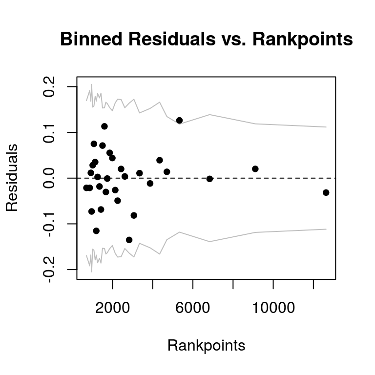
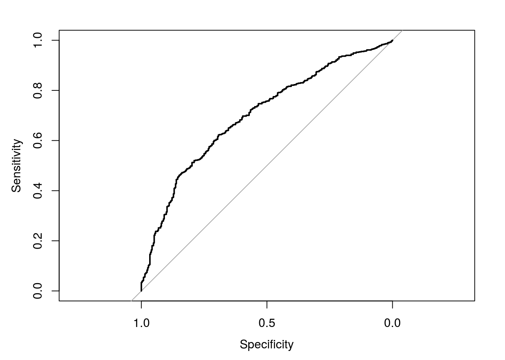

# Loaded Packages


```r
library(tidyverse)
library(olsrr)
library(cowplot)
library(car)
library(broom)
library(knitr)
library(arm)
library(tidyr)
library(pROC)
library(arm)
library(rlm)
```

# Data Manipulation


```r
atp <- read_csv("files/atp.csv")
atp2016 <- read_csv("files/atp2016.csv")
atp2015 <- read_csv("files/atp2015.csv")
atp2014 <- read_csv("files/atp2014.csv")
atp2013 <- read_csv("files/atp2013.csv")
atp2012 <- read_csv("files/atp2012.csv")
atp2011 <- read_csv("files/atp2011.csv")
atp2010 <- read_csv("files/atp2010.csv")

atp1 <- atp %>%
  filter(tourney_date < 20171113)

winners2016 <- atp2016 %>%
  filter(tourney_date < 20161114)

winners2015 <- atp2015 %>%
  filter(tourney_date < 20151115) 

winners2014 <- atp2014 %>%
  filter(tourney_date < 20141109) 

winners2013 <- atp2013 %>%
  filter(tourney_date < 20131104) 

winners2012 <- atp2012 %>%
  filter(tourney_date < 20121105) 

winners2011 <- atp2011 %>%
  filter(tourney_date < 20111114) 

winners2010 <- atp2010 %>%
  filter(tourney_date < 20101121) 

winners <- rbind(atp1, winners2016, winners2015, winners2014, winners2013, 
                 winners2012, winners2011, winners2010)

winners_set <- winners %>%
  filter(best_of == 3,
         !is.na(w_ace), 
         !is.na(w_df), 
         !is.na(w_svpt), 
         !is.na(w_1stIn), 
         !is.na(w_1stWon), 
         !is.na(w_2ndWon),
         !is.na(w_SvGms), 
         !is.na(w_bpSaved),
         !is.na(w_bpFaced),
         surface!="None")

losers <- winners_set %>%
  mutate(seed = loser_seed,
         name = loser_name,
         hand = loser_hand,
         ht = loser_ht,
         age = loser_age,
         rank = loser_rank,
         rankpoints = loser_rank_points,
         ace = l_ace,
         df = l_df,
         svpt = l_svpt,
         firsstIn = l_1stIn,
         firsttWon = l_1stWon,
         secondndWon = l_2ndWon,
         SvGms = l_SvGms,
         bpSaved = l_bpSaved,
         bpFaced = l_bpFaced,
         minutes = minutes,
         status = 0
         )  
  

winners <- winners_set %>%
  mutate(seed = winner_seed,
         name = winner_name,
         hand = winner_hand,
         ht = winner_ht,
         age = winner_age,
         rank = winner_rank,
         rankpoints = winner_rank_points,
         ace = w_ace,
         df = w_df,
         svpt = w_svpt,
         firsstIn = w_1stIn,
         firsttWon = w_1stWon,
         secondndWon = w_2ndWon,
         SvGms = w_SvGms,
         bpSaved = w_bpSaved,
         bpFaced = w_bpFaced,
         minutes = minutes,
         status = 1
         ) 
tennis <- rbind(winners,losers)

tennis <- tennis %>%
  filter(!is.na(seed),
         !is.na(name),
         !is.na(hand),
         !is.na(ht),
         !is.na(age),
         !is.na(rank),
         !is.na(rankpoints),
         !is.na(ace),
         !is.na(df),
         !is.na(svpt),
         !is.na(firsstIn),
         !is.na(firsttWon),
         !is.na(secondndWon),
         !is.na(SvGms),
         !is.na(bpSaved),
         !is.na(bpFaced),
         !is.na(minutes),
         !is.na(status))
```

# Data 

Using data manipulation skills in R, we shaped the dataset to show each observation as the outcome of the match for the winner and the loser of each match from 2010-2017. Below, is a glimpse of our dataset.


```r
glimpse(tennis)
```

```
## Observations: 11,037
## Variables: 66
## $ tourney_id         <chr> "2017-M020", "2017-M020", "2017-M020", "201...
## $ tourney_name       <chr> "Brisbane", "Brisbane", "Brisbane", "Brisba...
## $ surface            <chr> "Hard", "Hard", "Hard", "Hard", "Hard", "Ha...
## $ draw_size          <int> 32, 32, 32, 32, 32, 32, 32, 32, 32, 32, 32,...
## $ tourney_level      <chr> "A", "A", "A", "A", "A", "A", "A", "A", "A"...
## $ tourney_date       <int> 20170102, 20170102, 20170102, 20170102, 201...
## $ match_num          <int> 300, 299, 298, 297, 296, 295, 294, 293, 292...
## $ winner_id          <int> 105777, 105777, 105453, 105683, 105777, 105...
## $ winner_seed        <int> 7, 7, 3, 1, 7, 3, 2, 1, 5, 4, 7, 3, 2, 5, 7...
## $ winner_entry       <chr> NA, NA, NA, NA, NA, NA, NA, NA, NA, NA, NA,...
## $ winner_name        <chr> "Grigor Dimitrov", "Grigor Dimitrov", "Kei ...
## $ winner_hand        <chr> "R", "R", "R", "R", "R", "R", "R", "R", "L"...
## $ winner_ht          <int> 188, 188, 178, 196, 188, 178, 183, 196, 185...
## $ winner_ioc         <chr> "BUL", "BUL", "JPN", "CAN", "BUL", "JPN", "...
## $ winner_age         <dbl> 25.63450, 25.63450, 27.01164, 26.01780, 25....
## $ winner_rank        <int> 17, 17, 5, 3, 17, 5, 4, 3, 9, 8, 17, 5, 4, ...
## $ winner_rank_points <int> 2035, 2035, 4905, 5450, 2035, 4905, 5315, 5...
## $ loser_id           <int> 105453, 105683, 104527, 104745, 106233, 111...
## $ loser_seed         <int> 3, 1, 2, 5, 4, NA, NA, NA, NA, NA, NA, NA, ...
## $ loser_entry        <chr> NA, NA, NA, NA, NA, "WC", NA, NA, NA, "WC",...
## $ loser_name         <chr> "Kei Nishikori", "Milos Raonic", "Stanislas...
## $ loser_hand         <chr> "R", "R", "R", "L", "R", "R", "R", "R", "L"...
## $ loser_ht           <int> 178, 196, 183, 185, 185, NA, NA, 170, 190, ...
## $ loser_ioc          <chr> "JPN", "CAN", "SUI", "ESP", "AUT", "AUS", "...
## $ loser_age          <dbl> 27.01164, 26.01780, 31.76728, 30.58453, 23....
## $ loser_rank         <int> 5, 3, 4, 9, 8, 79, 45, 52, 51, 180, 39, 105...
## $ loser_rank_points  <int> 4905, 5450, 5315, 3300, 3415, 689, 1001, 86...
## $ score              <chr> "6-2 2-6 6-3", "7-6(7) 6-2", "7-6(3) 6-3", ...
## $ best_of            <int> 3, 3, 3, 3, 3, 3, 3, 3, 3, 3, 3, 3, 3, 3, 3...
## $ round              <chr> "F", "SF", "SF", "QF", "QF", "QF", "QF", "R...
## $ minutes            <int> 108, 87, 101, 140, 124, 61, 156, 69, 55, 89...
## $ w_ace              <int> 7, 4, 1, 23, 3, 3, 11, 12, 1, 11, 8, 3, 7, ...
## $ w_df               <int> 2, 1, 1, 3, 3, 0, 3, 1, 2, 1, 0, 3, 2, 1, 0...
## $ w_svpt             <int> 77, 58, 77, 97, 94, 34, 119, 53, 38, 65, 46...
## $ w_1stIn            <int> 52, 36, 56, 62, 52, 19, 67, 40, 18, 44, 27,...
## $ w_1stWon           <int> 41, 27, 37, 50, 42, 18, 47, 30, 15, 36, 25,...
## $ w_2ndWon           <int> 12, 18, 14, 16, 23, 10, 28, 7, 15, 15, 12, ...
## $ w_SvGms            <int> 13, 10, 11, 15, 14, 7, 16, 9, 7, 11, 9, 15,...
## $ w_bpSaved          <int> 5, 0, 4, 6, 13, 0, 11, 2, 2, 4, 3, 4, 0, 2,...
## $ w_bpFaced          <int> 7, 0, 5, 7, 14, 0, 13, 3, 2, 4, 3, 8, 1, 3,...
## $ l_ace              <int> 4, 4, 9, 4, 6, 1, 2, 0, 2, 11, 4, 6, 5, 2, ...
## $ l_df               <int> 0, 3, 2, 0, 5, 2, 2, 1, 2, 1, 3, 4, 7, 2, 3...
## $ l_svpt             <int> 69, 61, 61, 84, 82, 47, 97, 44, 38, 58, 52,...
## $ l_1stIn            <int> 49, 28, 37, 61, 37, 28, 65, 29, 25, 35, 37,...
## $ l_1stWon           <int> 36, 24, 27, 39, 29, 15, 52, 17, 13, 34, 27,...
## $ l_2ndWon           <int> 9, 16, 10, 14, 24, 5, 11, 6, 3, 9, 4, 20, 8...
## $ l_SvGms            <int> 12, 10, 10, 14, 14, 7, 16, 8, 7, 10, 9, 14,...
## $ l_bpSaved          <int> 2, 2, 0, 2, 4, 3, 6, 2, 3, 3, 0, 8, 3, 0, 4...
## $ l_bpFaced          <int> 5, 4, 2, 4, 7, 8, 10, 6, 8, 4, 3, 13, 5, 4,...
## $ seed               <int> 7, 7, 3, 1, 7, 3, 2, 1, 5, 4, 7, 3, 2, 5, 7...
## $ name               <chr> "Grigor Dimitrov", "Grigor Dimitrov", "Kei ...
## $ hand               <chr> "R", "R", "R", "R", "R", "R", "R", "R", "L"...
## $ ht                 <int> 188, 188, 178, 196, 188, 178, 183, 196, 185...
## $ age                <dbl> 25.63450, 25.63450, 27.01164, 26.01780, 25....
## $ rank               <int> 17, 17, 5, 3, 17, 5, 4, 3, 9, 8, 17, 5, 4, ...
## $ rankpoints         <int> 2035, 2035, 4905, 5450, 2035, 4905, 5315, 5...
## $ ace                <int> 7, 4, 1, 23, 3, 3, 11, 12, 1, 11, 8, 3, 7, ...
## $ df                 <int> 2, 1, 1, 3, 3, 0, 3, 1, 2, 1, 0, 3, 2, 1, 0...
## $ svpt               <int> 77, 58, 77, 97, 94, 34, 119, 53, 38, 65, 46...
## $ firsstIn           <int> 52, 36, 56, 62, 52, 19, 67, 40, 18, 44, 27,...
## $ firsttWon          <int> 41, 27, 37, 50, 42, 18, 47, 30, 15, 36, 25,...
## $ secondndWon        <int> 12, 18, 14, 16, 23, 10, 28, 7, 15, 15, 12, ...
## $ SvGms              <int> 13, 10, 11, 15, 14, 7, 16, 9, 7, 11, 9, 15,...
## $ bpSaved            <int> 5, 0, 4, 6, 13, 0, 11, 2, 2, 4, 3, 4, 0, 2,...
## $ bpFaced            <int> 7, 0, 5, 7, 14, 0, 13, 3, 2, 4, 3, 8, 1, 3,...
## $ status             <dbl> 1, 1, 1, 1, 1, 1, 1, 1, 1, 1, 1, 1, 1, 1, 1...
```

Because we have 11,037 observations, we will randomly select observations to be included in a smaller dataset so that we can effectively examine exploratory data analysis. Below, is our code on how we randomly selected the observations in our new dataset.


```r
set.seed(1234)
ten <- tennis %>% sample_n(1000)
```

Here is what our new dataset looks like:


```r
glimpse(ten)
```

```
## Observations: 1,000
## Variables: 66
## $ tourney_id         <chr> "2016-M021", "2010-314", "2010-404", "2010-...
## $ tourney_name       <chr> "Madrid Masters", "Gstaad", "Indian Wells M...
## $ surface            <chr> "Clay", "Clay", "Hard", "Grass", "Clay", "H...
## $ draw_size          <int> 64, 32, 96, 32, 56, 32, 32, 28, 32, 96, 32,...
## $ tourney_level      <chr> "M", "A", "M", "A", "A", "A", "A", "A", "A"...
## $ tourney_date       <int> 20160502, 20100725, 20100311, 20100705, 201...
## $ match_num          <int> 283, 29, 33, 27, 26, 293, 293, 3, 295, 37, ...
## $ winner_id          <int> 105683, 104755, 103819, 103888, 104857, 106...
## $ winner_seed        <int> 11, 7, 1, 5, NA, NA, 1, 7, 4, 11, 4, 16, 8,...
## $ winner_entry       <chr> NA, NA, NA, NA, "Q", "Q", NA, NA, NA, NA, N...
## $ winner_name        <chr> "Milos Raonic", "Richard Gasquet", "Roger F...
## $ winner_hand        <chr> "R", "R", "R", "R", "R", "R", "R", "R", "R"...
## $ winner_ht          <int> 196, 185, 185, 188, 193, NA, 178, 183, 198,...
## $ winner_ioc         <chr> "CAN", "FRA", "SUI", "USA", "COL", "SVK", "...
## $ winner_age         <dbl> 25.34702, 24.10404, 28.58042, 28.56947, 25....
## $ winner_rank        <int> 10, 47, 1, 79, 246, 117, 5, 41, 12, 12, 12,...
## $ winner_rank_points <int> 2740, 930, 11350, 651, 195, 501, 4625, 1010...
## $ loser_id           <int> 105238, 103393, 103812, 104433, 104665, 105...
## $ loser_seed         <int> NA, NA, NA, NA, 16, 1, NA, NA, 7, NA, 8, NA...
## $ loser_entry        <chr> NA, "Q", NA, NA, NA, NA, NA, NA, NA, "Q", N...
## $ loser_name         <chr> "Alexandr Dolgopolov", "Yuri Schukin", "Vic...
## $ loser_hand         <chr> "R", "R", "R", "R", "R", "R", "R", "R", "R"...
## $ loser_ht           <int> 180, 188, 198, 185, 180, 198, 170, 188, 183...
## $ loser_ioc          <chr> "UKR", "KAZ", "ROU", "CAN", "ESP", "CRO", "...
## $ loser_age          <dbl> 27.48255, 31.08282, 28.62971, 25.77139, 26....
## $ loser_rank         <int> 29, 147, 43, 336, 38, 6, 50, 122, 19, 89, 2...
## $ loser_rank_points  <int> 1330, 344, 905, 115, 1070, 3650, 890, 500, ...
## $ score              <chr> "6-4 6-7(3) 6-2", "6-3 6-4", "6-3 6-7(5) 6-...
## $ best_of            <int> 3, 3, 3, 3, 3, 3, 3, 3, 3, 3, 3, 3, 3, 3, 3...
## $ round              <chr> "R32", "SF", "R64", "QF", "R32", "R16", "R1...
## $ minutes            <int> 121, 89, 117, 134, 170, 168, 124, 120, 132,...
## $ w_ace              <int> 17, 6, 10, 7, 9, 8, 3, 1, 19, 9, 22, 6, 7, ...
## $ w_df               <int> 2, 6, 2, 2, 1, 2, 0, 1, 1, 3, 4, 0, 1, 3, 1...
## $ w_svpt             <int> 95, 72, 95, 91, 123, 130, 92, 82, 86, 57, 8...
## $ w_1stIn            <int> 70, 42, 52, 45, 76, 83, 61, 62, 58, 39, 54,...
## $ w_1stWon           <int> 56, 33, 41, 38, 49, 55, 43, 39, 51, 32, 42,...
## $ w_2ndWon           <int> 14, 16, 27, 26, 25, 30, 13, 12, 18, 10, 21,...
## $ w_SvGms            <int> 15, 10, 15, 16, 17, 18, 14, 12, 15, 10, 15,...
## $ w_bpSaved          <int> 4, 2, 6, 2, 10, 9, 8, 5, 0, 2, 4, 1, 1, 0, ...
## $ w_bpFaced          <int> 4, 2, 7, 5, 15, 11, 11, 7, 0, 3, 5, 1, 4, 1...
## $ l_ace              <int> 7, 2, 1, 6, 1, 18, 2, 0, 2, 1, 13, 5, 17, 5...
## $ l_df               <int> 1, 1, 1, 5, 5, 2, 0, 5, 1, 4, 7, 2, 5, 5, 0...
## $ l_svpt             <int> 95, 57, 101, 98, 103, 113, 81, 82, 108, 69,...
## $ l_1stIn            <int> 56, 32, 77, 54, 64, 69, 56, 53, 82, 49, 44,...
## $ l_1stWon           <int> 39, 25, 48, 42, 47, 53, 35, 34, 51, 33, 32,...
## $ l_2ndWon           <int> 24, 12, 10, 15, 17, 26, 8, 13, 16, 8, 30, 6...
## $ l_SvGms            <int> 15, 9, 13, 16, 17, 18, 14, 12, 16, 10, 14, ...
## $ l_bpSaved          <int> 3, 4, 8, 1, 3, 3, 4, 9, 4, 8, 8, 2, 6, 6, 7...
## $ l_bpFaced          <int> 6, 6, 12, 6, 8, 5, 10, 13, 7, 11, 12, 6, 8,...
## $ seed               <int> 11, 7, 1, 5, 16, 1, 1, 7, 7, 11, 8, 16, 8, ...
## $ name               <chr> "Milos Raonic", "Richard Gasquet", "Roger F...
## $ hand               <chr> "R", "R", "R", "R", "R", "R", "R", "R", "R"...
## $ ht                 <int> 196, 185, 185, 188, 180, 198, 178, 183, 183...
## $ age                <dbl> 25.34702, 24.10404, 28.58042, 28.56947, 26....
## $ rank               <int> 10, 47, 1, 79, 38, 6, 5, 41, 19, 12, 22, 24...
## $ rankpoints         <int> 2740, 930, 11350, 651, 1070, 3650, 4625, 10...
## $ ace                <int> 17, 6, 10, 7, 1, 18, 3, 1, 2, 9, 13, 6, 7, ...
## $ df                 <int> 2, 6, 2, 2, 5, 2, 0, 1, 1, 3, 7, 0, 1, 5, 1...
## $ svpt               <int> 95, 72, 95, 91, 103, 113, 92, 82, 108, 57, ...
## $ firsstIn           <int> 70, 42, 52, 45, 64, 69, 61, 62, 82, 39, 44,...
## $ firsttWon          <int> 56, 33, 41, 38, 47, 53, 43, 39, 51, 32, 32,...
## $ secondndWon        <int> 14, 16, 27, 26, 17, 26, 13, 12, 16, 10, 30,...
## $ SvGms              <int> 15, 10, 15, 16, 17, 18, 14, 12, 16, 10, 14,...
## $ bpSaved            <int> 4, 2, 6, 2, 3, 3, 8, 5, 4, 2, 8, 1, 1, 6, 1...
## $ bpFaced            <int> 4, 2, 7, 5, 8, 5, 11, 7, 7, 3, 12, 1, 4, 10...
## $ status             <dbl> 1, 1, 1, 1, 0, 0, 1, 1, 0, 1, 0, 1, 1, 0, 1...
```

# Exploratory Data Analysis 

To begin our exploratory data analysis, we will examine a matrix plot of the variables in our dataset to consider multicollinearity and large leverage of certain observations.

## Matrix Plot

```r
ten <- ten %>%
  mutate(status = as.factor(status)) 

pairs(status ~ minutes + ht + age + rank + rankpoints + ace +
        df + svpt + firsstIn + firsttWon + secondndWon + 
        SvGms + bpSaved + bpFaced, data=ten, pch = 16,
      main = "Matrix of scatterplots for Tournament Wins and Variables")
```


Looking at the matrix plot, we will consider removing the following favirables because of multicollinearity: `svpt`, `firsstIn`, `firsttWon`, `secondndWon`, `SvGms`, and `bpFaced`.

We will now look at box plots of the numeric variables we will include in our full model:


```r
p1 <- ggplot(data=ten,aes(x=status,y=minutes, group=status)) +
  geom_boxplot() + 
  labs(title="Minutes by Status",
       x = "0 if Lost, 1 if Won",
       y = "Minutes")
p2 <- ggplot(data=ten,aes(x=status,y=ht, group=status)) +
  geom_boxplot() + 
  labs(title="Height by Status",
       x = "0 if Lost, 1 if Won",
       y = "Height")
p3 <- ggplot(data=ten,aes(x=status,y=age, group=status)) +
  geom_boxplot() + 
  labs(title="Age by Status",
       x = "0 if Lost, 1 if Won",
       y = "Age (years)")
p4 <- ggplot(data=ten,aes(x=status,y=rank, group=status)) +
  geom_boxplot() + 
  labs(title="Ranking by Status",
       x = "0 if Lost, 1 if Won",
       y = "Rank")
p5 <- ggplot(data=ten,aes(x=status,y=rankpoints, group=status)) +
  geom_boxplot() + 
  labs(title="Rankpoints by Status",
       x = "0 if Lost, 1 if Won",
       y = "Rankpoints")
p6 <- ggplot(data=ten,aes(x=status,y=ace, group=status)) +
  geom_boxplot() + 
  labs(title="Aces by Status",
       x = "0 if Lost, 1 if Won",
       y = "Aces")
p7 <- ggplot(data=ten,aes(x=status,y=df, group=status)) +
  geom_boxplot() + 
  labs(title="Double Faults by Status",
       x = "0 if Lost, 1 if Won",
       y = "Double Faults")
p8 <- ggplot(data=ten,aes(x=status,y=bpSaved, group=status)) +
  geom_boxplot() + 
  labs(title="Saved Breakpoints by Status",
       x = "0 if Lost, 1 if Won",
       y = "Saved Breakpoints")

plot_grid(p1,p2,p3,p4,p5,
          p6,p7,p8,ncol=2)
```


And we will include a stacked bar graph for the variable `surface`.


```r
ggplot(data=ten,aes(x=surface, fill = status)) + geom_bar(position = "fill") + 
  labs(title="Status vs. Surface")
```


In looking at all of these observations, it seems like the medians of the numeric distributions do not seem to differ that much by status of winning or losing. The same can be said about the proportions of winning and losing matches against all three surfaces. In creating our model, it could be difficult to see which variables could be helpful in differentiating between whether a player will win a match or not. But, we hope to see that a combination of these variables will be helpful in determining a model that best predicts the percentage of winning a match.

# Logistic Regression Model

To begin our regression models, we will use all of the variables we deemed important from our exploratory data analysis.


```r
full_model <- glm(status ~ minutes + ht + age + rank + 
                rankpoints + ace + df + bpSaved + surface, 
                family=binomial,data=ten)
kable(tidy(full_model), format="markdown", digits = 3)
```


|term         | estimate| std.error| statistic| p.value|
|:------------|--------:|---------:|---------:|-------:|
|(Intercept)  |    5.060|     2.219|     2.280|   0.023|
|minutes      |   -0.007|     0.003|    -2.607|   0.009|
|ht           |   -0.024|     0.011|    -2.278|   0.023|
|age          |    0.024|     0.022|     1.085|   0.278|
|rank         |   -0.002|     0.006|    -0.279|   0.780|
|rankpoints   |    0.000|     0.000|     3.963|   0.000|
|ace          |    0.108|     0.019|     5.674|   0.000|
|df           |   -0.140|     0.037|    -3.830|   0.000|
|bpSaved      |   -0.077|     0.029|    -2.650|   0.008|
|surfaceGrass |   -0.580|     0.280|    -2.076|   0.038|
|surfaceHard  |   -0.494|     0.165|    -3.000|   0.003|


```r
full_w_interactions <- glm(status ~ minutes + ht + age + rank + 
                rankpoints + ace + df + bpSaved + surface + surface * minutes +
                surface * ht + surface * age + surface * rank + surface * rankpoints + 
                surface * ace + surface * df + surface * bpSaved,
                family=binomial,data=ten)
```


```r
model.selected.interactions <- step(full_w_interactions,direction="backward")
```

```
## Start:  AIC=1202.97
## status ~ minutes + ht + age + rank + rankpoints + ace + df + 
##     bpSaved + surface + surface * minutes + surface * ht + surface * 
##     age + surface * rank + surface * rankpoints + surface * ace + 
##     surface * df + surface * bpSaved
## 
##                      Df Deviance    AIC
## - rank:surface        2   1149.4 1199.4
## - age:surface         2   1150.3 1200.3
## - bpSaved:surface     2   1150.5 1200.5
## - rankpoints:surface  2   1150.5 1200.5
## - minutes:surface     2   1150.6 1200.6
## <none>                    1149.0 1203.0
## - df:surface          2   1154.7 1204.7
## - ht:surface          2   1154.7 1204.7
## - ace:surface         2   1156.9 1206.9
## 
## Step:  AIC=1199.39
## status ~ minutes + ht + age + rank + rankpoints + ace + df + 
##     bpSaved + surface + minutes:surface + ht:surface + age:surface + 
##     rankpoints:surface + ace:surface + df:surface + bpSaved:surface
## 
##                      Df Deviance    AIC
## - bpSaved:surface     2   1150.7 1196.7
## - age:surface         2   1150.8 1196.8
## - minutes:surface     2   1150.9 1196.9
## - rankpoints:surface  2   1151.1 1197.1
## - rank                1   1149.6 1197.6
## <none>                    1149.4 1199.4
## - ht:surface          2   1154.8 1200.8
## - df:surface          2   1154.8 1200.8
## - ace:surface         2   1157.6 1203.6
## 
## Step:  AIC=1196.71
## status ~ minutes + ht + age + rank + rankpoints + ace + df + 
##     bpSaved + surface + minutes:surface + ht:surface + age:surface + 
##     rankpoints:surface + ace:surface + df:surface
## 
##                      Df Deviance    AIC
## - minutes:surface     2   1151.6 1193.6
## - age:surface         2   1151.9 1193.9
## - rankpoints:surface  2   1152.4 1194.4
## - rank                1   1150.9 1194.9
## <none>                    1150.7 1196.7
## - ht:surface          2   1156.4 1198.4
## - ace:surface         2   1158.1 1200.1
## - bpSaved             1   1156.8 1200.8
## - df:surface          2   1159.6 1201.6
## 
## Step:  AIC=1193.59
## status ~ minutes + ht + age + rank + rankpoints + ace + df + 
##     bpSaved + surface + ht:surface + age:surface + rankpoints:surface + 
##     ace:surface + df:surface
## 
##                      Df Deviance    AIC
## - age:surface         2   1153.0 1191.0
## - rankpoints:surface  2   1153.7 1191.7
## - rank                1   1151.8 1191.8
## <none>                    1151.6 1193.6
## - ht:surface          2   1156.8 1194.8
## - ace:surface         2   1158.4 1196.4
## - bpSaved             1   1157.6 1197.6
## - df:surface          2   1160.4 1198.4
## - minutes             1   1159.3 1199.3
## 
## Step:  AIC=1190.98
## status ~ minutes + ht + age + rank + rankpoints + ace + df + 
##     bpSaved + surface + ht:surface + rankpoints:surface + ace:surface + 
##     df:surface
## 
##                      Df Deviance    AIC
## - rankpoints:surface  2   1154.9 1188.9
## - rank                1   1153.2 1189.2
## - age                 1   1153.5 1189.5
## <none>                    1153.0 1191.0
## - ht:surface          2   1158.7 1192.7
## - ace:surface         2   1160.6 1194.6
## - bpSaved             1   1159.2 1195.2
## - df:surface          2   1162.2 1196.2
## - minutes             1   1160.8 1196.8
## 
## Step:  AIC=1188.92
## status ~ minutes + ht + age + rank + rankpoints + ace + df + 
##     bpSaved + surface + ht:surface + ace:surface + df:surface
## 
##               Df Deviance    AIC
## - rank         1   1155.1 1187.1
## - age          1   1155.5 1187.5
## <none>             1154.9 1188.9
## - ht:surface   2   1160.6 1190.6
## - ace:surface  2   1162.5 1192.5
## - bpSaved      1   1161.3 1193.3
## - minutes      1   1162.9 1194.9
## - df:surface   2   1164.9 1194.9
## - rankpoints   1   1173.8 1205.8
## 
## Step:  AIC=1187.07
## status ~ minutes + ht + age + rankpoints + ace + df + bpSaved + 
##     surface + ht:surface + ace:surface + df:surface
## 
##               Df Deviance    AIC
## - age          1   1155.6 1185.6
## <none>             1155.1 1187.1
## - ht:surface   2   1160.7 1188.7
## - ace:surface  2   1162.7 1190.7
## - bpSaved      1   1161.7 1191.7
## - minutes      1   1162.9 1192.9
## - df:surface   2   1165.1 1193.1
## - rankpoints   1   1193.0 1223.0
## 
## Step:  AIC=1185.62
## status ~ minutes + ht + rankpoints + ace + df + bpSaved + surface + 
##     ht:surface + ace:surface + df:surface
## 
##               Df Deviance    AIC
## <none>             1155.6 1185.6
## - ht:surface   2   1161.4 1187.4
## - ace:surface  2   1163.5 1189.5
## - bpSaved      1   1162.1 1190.1
## - minutes      1   1163.8 1191.8
## - df:surface   2   1165.8 1191.8
## - rankpoints   1   1193.6 1221.6
```

# Model


```r
final.base.model <- model.selected.interactions
kable(tidy(final.base.model), format = "markdown", digits = 3)
```


|term             | estimate| std.error| statistic| p.value|
|:----------------|--------:|---------:|---------:|-------:|
|(Intercept)      |   10.392|     3.518|     2.954|   0.003|
|minutes          |   -0.008|     0.003|    -2.844|   0.004|
|ht               |   -0.048|     0.019|    -2.547|   0.011|
|rankpoints       |    0.000|     0.000|     5.441|   0.000|
|ace              |    0.110|     0.040|     2.764|   0.006|
|df               |   -0.243|     0.070|    -3.474|   0.001|
|bpSaved          |   -0.075|     0.029|    -2.548|   0.011|
|surfaceGrass     |    5.285|     8.299|     0.637|   0.524|
|surfaceHard      |   -8.048|     4.294|    -1.874|   0.061|
|ht:surfaceGrass  |   -0.043|     0.045|    -0.940|   0.347|
|ht:surfaceHard   |    0.040|     0.023|     1.710|   0.087|
|ace:surfaceGrass |    0.164|     0.080|     2.048|   0.041|
|ace:surfaceHard  |   -0.021|     0.045|    -0.469|   0.639|
|df:surfaceGrass  |    0.425|     0.132|     3.205|   0.001|
|df:surfaceHard   |    0.107|     0.082|     1.297|   0.195|

# Model Assessment

## Binned Plots with Residuals vs Predicted


```r
ten <- ten %>% mutate(Residuals = residuals.glm(final.base.model,type="response"),
                          Predicted = predict.glm(final.base.model,type="response"))

binnedplot(ten$Predicted, ten$Residuals,xlab="Predicted Probabilities",
           ylab="Residuals",main="Binned Residuals vs. Predicted Probabilities")
```





```r
ROC.ten <- roc(ten$status,ten$Predicted,plot=T)
```


```r
ROC.ten$auc
```

```
## Area under the curve: 0.7268
```


```r
threshold = 0.30
table(ten$status, ten$Predicted > threshold)
```

```
##    
##     FALSE TRUE
##   0    26  326
##   1    13  635
```


```r
(326 + 13)/(26+13+326+635)
```

```
## [1] 0.339
```
# Influential Points 

## VIF


```r
tidy(vif(final.base.model))
```

```
## Warning: 'tidy.matrix' is deprecated.
## See help("Deprecated")
```

```
## # A tibble: 10 x 4
##    .rownames        GVIF    Df GVIF..1..2.Df..
##    <chr>           <dbl> <dbl>           <dbl>
##  1 minutes          1.45     1            1.21
##  2 ht               3.99     1            2.00
##  3 rankpoints       1.04     1            1.02
##  4 ace              6.82     1            2.61
##  5 df               4.02     1            2.00
##  6 bpSaved          1.32     1            1.15
##  7 surface     650920.       2           28.4 
##  8 ht:surface  721588.       2           29.1 
##  9 ace:surface     43.8      2            2.57
## 10 df:surface      14.7      2            1.96
```

After looking at the VIF values, we see that the VIF for `surface` is greater than 10, so we will also remove it from the model. This means we will also have to remove the interaction variables as well. 

# Linear Regression Assumptions: Revised

Because one of our residuals plots has a non-linear relationship, we will remove `bpSaved` from the model and redo the assumptions. We will also remove `surface` and its corresponding interactions effects. 


```r
newten <- ten
final <- glm(status ~ minutes + ht + rankpoints + ace + df, family = binomial, data = newten)
kable(tidy(final), format = "markdown", digits = 3)
```


|term        | estimate| std.error| statistic| p.value|
|:-----------|--------:|---------:|---------:|-------:|
|(Intercept) |    5.197|     1.951|     2.664|   0.008|
|minutes     |   -0.009|     0.002|    -3.715|   0.000|
|ht          |   -0.023|     0.010|    -2.221|   0.026|
|rankpoints  |    0.000|     0.000|     5.238|   0.000|
|ace         |    0.094|     0.018|     5.371|   0.000|
|df          |   -0.169|     0.036|    -4.770|   0.000|


```r
pairs(status ~ minutes + ht + rankpoints + ace + df, data = newten)
```



The scatterplot matrix does not show obvious signs of multicollinearity. 

# Model Assessment

## Binned Plots with Residuals vs Predicted


```r
newten <- newten %>% mutate(Residuals = residuals.glm(final,type="response"),
                          Predicted = predict.glm(final,type="response"))

binnedplot(newten$Predicted, newten$Residuals,xlab="Predicted Probabilities",
           ylab="Residuals",main="Binned Residuals vs. Predicted Probabilities")
```






```r
ROC.newten <- roc(newten$status,newten$Predicted,plot=T)
```




```r
ROC.newten$auc
```

```
## Area under the curve: 0.6996
```


```r
threshold = 0.30
table(newten$status, newten$Predicted > threshold)
```

```
##    
##     FALSE TRUE
##   0    10  342
##   1    10  638
```


```r
(342 + 10)/(342 + 10 + 10 + 638)
```

```
## [1] 0.352
```


# Prediction

## Test cases: 

We will look at a match that was played the Monte Carlo Masters in 2014 between Roger Federer and Novak Djokovic. We want to see the probability that a player will win the match. 


```r
tennis %>%
  filter(tourney_name == "Monte Carlo Masters",
         name == "Roger Federer" |  name == "Novak Djokovic",
         tourney_id == "2014-410",
         loser_name == "Novak Djokovic")
```

```
## # A tibble: 2 x 66
##   tourney_id tourney_name surface draw_size tourney_level tourney_date
##   <chr>      <chr>        <chr>       <int> <chr>                <int>
## 1 2014-410   Monte Carlo… Clay           56 M                 20140413
## 2 2014-410   Monte Carlo… Clay           56 M                 20140413
## # ... with 60 more variables: match_num <int>, winner_id <int>,
## #   winner_seed <int>, winner_entry <chr>, winner_name <chr>,
## #   winner_hand <chr>, winner_ht <int>, winner_ioc <chr>,
## #   winner_age <dbl>, winner_rank <int>, winner_rank_points <int>,
## #   loser_id <int>, loser_seed <int>, loser_entry <chr>, loser_name <chr>,
## #   loser_hand <chr>, loser_ht <int>, loser_ioc <chr>, loser_age <dbl>,
## #   loser_rank <int>, loser_rank_points <int>, score <chr>, best_of <int>,
## #   round <chr>, minutes <int>, w_ace <int>, w_df <int>, w_svpt <int>,
## #   w_1stIn <int>, w_1stWon <int>, w_2ndWon <int>, w_SvGms <int>,
## #   w_bpSaved <int>, w_bpFaced <int>, l_ace <int>, l_df <int>,
## #   l_svpt <int>, l_1stIn <int>, l_1stWon <int>, l_2ndWon <int>,
## #   l_SvGms <int>, l_bpSaved <int>, l_bpFaced <int>, seed <int>,
## #   name <chr>, hand <chr>, ht <int>, age <dbl>, rank <int>,
## #   rankpoints <int>, ace <int>, df <int>, svpt <int>, firsstIn <int>,
## #   firsttWon <int>, secondndWon <int>, SvGms <int>, bpSaved <int>,
## #   bpFaced <int>, status <dbl>
```


```r
fed <- data.frame(minutes = 75, ht = 185, rankpoints = 5355 , ace = 3 , df = 1)
djo1 <- data.frame(minutes = 75, ht = 188, rankpoints = 11680, ace = 2, df = 0)
predict(final, newdata=fed, type="response")
```

```
##         1 
## 0.7937041
```

```r
predict(final, newdata=djo1, type="response")
```

```
##         1 
## 0.9251785
```


```r
predsdjo1 <- predict(final, djo1, type="response", se.fit=TRUE)
predsfed <- predict(final, fed, type="response", se.fit=TRUE)

predfdjo1 <- predsdjo1$fit # predicted
lowerdjo1 <- predsdjo1$fit - (1.96*predsdjo1$se.fit) # lower bounds
upperdjo1 <- predsdjo1$fit + (1.96*predsdjo1$se.fit) # upper bounds

predffed <- predsfed$fit # predicted
lowerfed <- predsfed$fit - (1.96*predsfed$se.fit) # lower bounds
upperfed <- predsfed$fit + (1.96*predsfed$se.fit) # lower bounds

c(predfdjo1, lowerdjo1, upperdjo1)
```

```
##         1         1         1 
## 0.9251785 0.8782777 0.9720793
```

```r
c(predffed, lowerfed, upperfed)
```

```
##         1         1         1 
## 0.7937041 0.7473870 0.8400212
```

We see that the model predicts Roger Federer has a 79.37% chance of winning the match, while Novak Djokovic has a 92.52% chance of winning the match. This is mainly because Djokovic's rank points were almost double that of Federer's at the time. However, Federer won the match. In this case, we had an anomaly. 

The next match we will look at was played at the China Open in 2013 and was between Novak Djokovic and Rafael Nadal.


```r
tennis %>%
  filter(name == "Novak Djokovic" | name == "Rafael Nadal",
         tourney_name == "Beijing",
         loser_name == "Rafael Nadal",
         tourney_id == "2013-747")
```

```
## # A tibble: 2 x 66
##   tourney_id tourney_name surface draw_size tourney_level tourney_date
##   <chr>      <chr>        <chr>       <int> <chr>                <int>
## 1 2013-747   Beijing      Hard           32 A                 20130930
## 2 2013-747   Beijing      Hard           32 A                 20130930
## # ... with 60 more variables: match_num <int>, winner_id <int>,
## #   winner_seed <int>, winner_entry <chr>, winner_name <chr>,
## #   winner_hand <chr>, winner_ht <int>, winner_ioc <chr>,
## #   winner_age <dbl>, winner_rank <int>, winner_rank_points <int>,
## #   loser_id <int>, loser_seed <int>, loser_entry <chr>, loser_name <chr>,
## #   loser_hand <chr>, loser_ht <int>, loser_ioc <chr>, loser_age <dbl>,
## #   loser_rank <int>, loser_rank_points <int>, score <chr>, best_of <int>,
## #   round <chr>, minutes <int>, w_ace <int>, w_df <int>, w_svpt <int>,
## #   w_1stIn <int>, w_1stWon <int>, w_2ndWon <int>, w_SvGms <int>,
## #   w_bpSaved <int>, w_bpFaced <int>, l_ace <int>, l_df <int>,
## #   l_svpt <int>, l_1stIn <int>, l_1stWon <int>, l_2ndWon <int>,
## #   l_SvGms <int>, l_bpSaved <int>, l_bpFaced <int>, seed <int>,
## #   name <chr>, hand <chr>, ht <int>, age <dbl>, rank <int>,
## #   rankpoints <int>, ace <int>, df <int>, svpt <int>, firsstIn <int>,
## #   firsttWon <int>, secondndWon <int>, SvGms <int>, bpSaved <int>,
## #   bpFaced <int>, status <dbl>
```


```r
djo2 <- data.frame(minutes = 87, ht = 188, rankpoints = 11120, ace = 5, df = 1)
nadal <- data.frame(minutes = 87, ht = 185, rankpoints = 10860, ace = 2, df = 2)
predict(final, newdata=djo2, type="response")
```

```
##         1 
## 0.9182071
```

```r
predict(final, newdata=nadal, type="response")
```

```
##         1 
## 0.8795555
```

We see that the model predicts Novak Djokovic has a 91.82% chance of winning the match, while Rafael Nadal has a 87.96% chance of winning the match. Djokovic won the match. 

### Test Case with Similar Rank Points 

Now, we'll look at a match where both players had similar rank points. The match we will look at is between Jo Wilfried Tsonga and Michael Llodra, and was played at the Queen's Club Championships in 2011. 


```r
ten %>%
  filter(winner_rank_points > 1000 & winner_rank_points < 2000 & loser_rank_points > 1000 & loser_rank_points < 2000,
         tourney_id == "2011-311",
         tourney_name == "Queen's Club",
         winner_name == "Jo Wilfried Tsonga"
         )
```

```
## # A tibble: 1 x 68
##   tourney_id tourney_name surface draw_size tourney_level tourney_date
##   <chr>      <chr>        <chr>       <int> <chr>                <int>
## 1 2011-311   Queen's Club Grass          56 A                 20110606
## # ... with 62 more variables: match_num <int>, winner_id <int>,
## #   winner_seed <int>, winner_entry <chr>, winner_name <chr>,
## #   winner_hand <chr>, winner_ht <int>, winner_ioc <chr>,
## #   winner_age <dbl>, winner_rank <int>, winner_rank_points <int>,
## #   loser_id <int>, loser_seed <int>, loser_entry <chr>, loser_name <chr>,
## #   loser_hand <chr>, loser_ht <int>, loser_ioc <chr>, loser_age <dbl>,
## #   loser_rank <int>, loser_rank_points <int>, score <chr>, best_of <int>,
## #   round <chr>, minutes <int>, w_ace <int>, w_df <int>, w_svpt <int>,
## #   w_1stIn <int>, w_1stWon <int>, w_2ndWon <int>, w_SvGms <int>,
## #   w_bpSaved <int>, w_bpFaced <int>, l_ace <int>, l_df <int>,
## #   l_svpt <int>, l_1stIn <int>, l_1stWon <int>, l_2ndWon <int>,
## #   l_SvGms <int>, l_bpSaved <int>, l_bpFaced <int>, seed <int>,
## #   name <chr>, hand <chr>, ht <int>, age <dbl>, rank <int>,
## #   rankpoints <int>, ace <int>, df <int>, svpt <int>, firsstIn <int>,
## #   firsttWon <int>, secondndWon <int>, SvGms <int>, bpSaved <int>,
## #   bpFaced <int>, status <fct>, Residuals <dbl>, Predicted <dbl>
```


```r
jo <- data.frame(minutes = 23, ht = 188, rankpoints = 1480, ace = 2, df = 1)
llodra <- data.frame(minutes = 23, ht = 190, rankpoints = 1400, ace = 0, df = 0)
predict(final, newdata=jo, type="response")
```

```
##         1 
## 0.7180615
```

```r
predict(final, newdata=llodra, type="response")
```

```
##         1 
## 0.7016269
```


```r
predsjo <- predict(final, jo, type="response", se.fit=TRUE)
predsllodra <- predict(final, llodra, type="response", se.fit=TRUE)

predfjo <- predsjo$fit # predicted
lowerjo <- predsjo$fit - (1.96*predsjo$se.fit) # lower bounds
upperjo <- predsjo$fit + (1.96*predsjo$se.fit) # upper bounds

predfllodra <- predsllodra$fit # predicted
lowerllodra <- predsllodra$fit - (1.96*predsllodra$se.fit) # lower bounds
upperllodra <- predsllodra$fit + (1.96*predsllodra$se.fit) # lower bounds

c(predfjo, lowerjo, upperjo)
```

```
##         1         1         1 
## 0.7180615 0.6457283 0.7903948
```

```r
c(predfllodra, lowerllodra, upperllodra)
```

```
##         1         1         1 
## 0.7016269 0.6204569 0.7827970
```


We see that the model predicts Jo Wilfried Tsonga has a 71.81% of chance of winning the match, while Michael Llodra has a 70.16% chance of winning the match. These percentages are lower because the players' rankpoints are significantly lower than those of Nadal's and Djokovic's. 

# Conclusion


